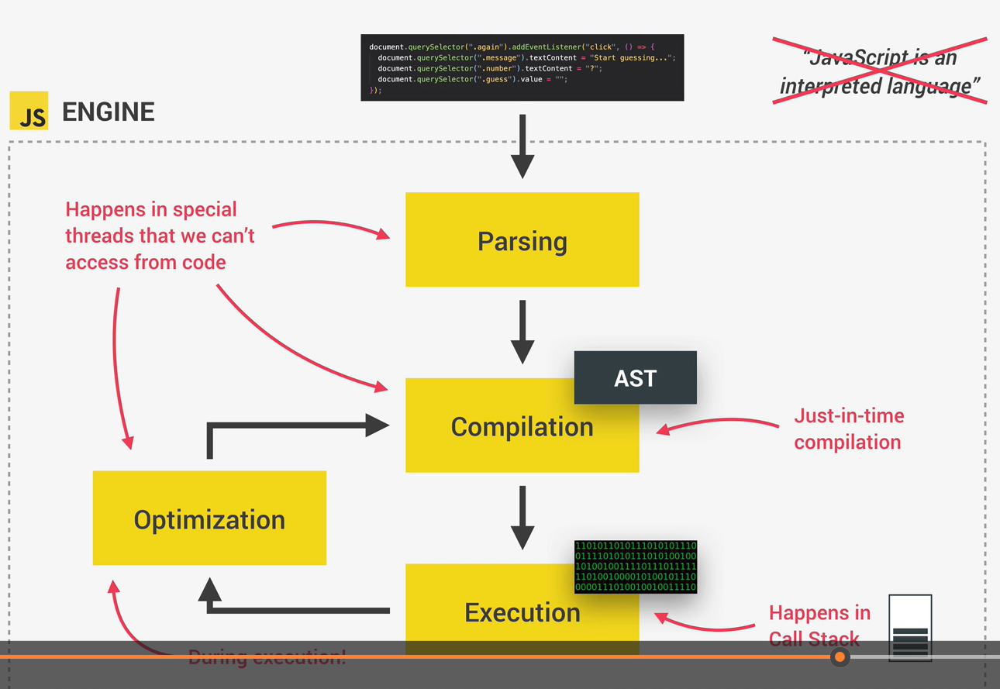
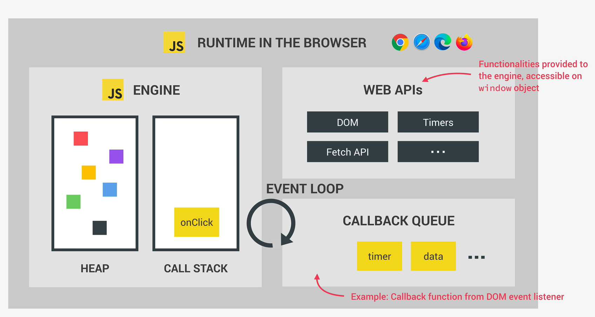

# JavaScript behind the scene

## Basics

**JS is high-level language - does not manage sources (memory, processor)**

**Garbage collection - memory management. Cleaning the memory so we do not have to.**

**Just in time compiled language. Converting human-readable code to machine code (zeros) is COMPILING.**

**Multi-paradigm language - Procedural programming, OOP, Functional programming.**

**JS is prototype-based object-oriented language. (e.g. Array.prototype.push)**

**First-class functions - functions are simply treated as variables. We can pass functions into other functions...**

**JS is dynamically typed.**

**Single-threaded. One task at the time.**

**Non-blocking event loop. Takes long-running tasks, executes them in the background, and puts them back in the main thread once they are finished.**

## JavaScript engine and runetime

JS engine - program that **executes** javascript code. Every browser has own JS engine. (**V8 Engine**).

Every **JS Engine** includes **call stack** and **heap**.

Call stack is where our code is executed. Execution context.

Heap is where **objects are stored**.

For code to be executed, frist we need to compile our code into machine code - **compiling**.

[//]: # (NO PORTABLE FILE as a mid-step)
SOURCE CODE -> (_compilation_) MACHINE CODE -> (_execution_) Program running

**Compilation**: Entire code is converted into machine code at once, and written to the binary file that can be executed by computer.

**Interpretation** Interpreter runs through the source code and executes it line by line.



## Runtime in the browser




### Inside execution context:
 Variable environment: `let`, `const`, and `var` declarations; Functions, `arguments` object.

Arrow functions does not include `this` keyword nor `arguments`.

**CALL STACK** place where execution context get stacked on top of each other, to keep track where we are in execution.

Global execution context is pop-out when we close browser window(or tab). Only then program is really finish.

## Scoping

**Scope** - place or environment in which certain variable is **declared**. Where do variables live. There is **global** scope, **function** scope and (ES6)**block** scope.

**Scoping**: How our program variables are **organized** and **accessed**.

**Three type of scopes: The global scope, scope defined by functions, scopes defined by blocks**

**Only `let` and `const` variables are block-scoped. Variables defined with `var` are end up in the closest functional scope.**

Functions are also **block scoped** (only in strict mode).

**Every scope has access to all the variables from all its outer scopes. This is scope chain.**

**When a variable is not in the current scope, the engine looks up in the scope chain until it finds the variable looking for. This is called variable lookup.**

**Scope chain is one-way street. The scope will never has access to the variables of inner scope.**

**The scope chain has nothing to the order in which functions were called.**

```js
// Variables from global scope are at the top of scope chain!
const myName: string = "Nemanja"; // Global scope. Variables from global scope are accessible from everywhere!

function first(): void {
    const age = 25;
    
    if(age >= 30) {
        // let and const are block-scoped (ES6)
        const decade = 2;

        // var is function-scoped. So, in this example first() has access to it and second() as well.
        var millenium = true;
    }

    function second(): void {
        const job = 'teacher';

        // Variables myAge and age are not within this function scope, so it will look up for them
        // Scope has access to variables from all outer scopes! (scope chain)
        console.log(`${myName} is ${age} years old and ${job}`)
    }
    // Scope chain works only upwards not downwards or sidewards.
    
    second()
}

const x = first();
```

## Hoisting

**Hoisting:** Makes some types of variables accessible/usable before they are actually declared.

Before execution, code is scanned for variable declarations, and for each variable a new property is created in the **variable environment object**.

**Calling function before its declaration - sometimes it seems like functions are moved to the top of scope chain**

**This is not working for `let` and `const` - if we try to call them before its initialization,  error occurs: Can't access before initialization (Temporal Dead Zone). `job = uninitialized`**

**`var` is byproduct. Using `var` in hosting will not throw error, but instead we would get `undefined` as a `var` value. Which makes bugs not that easy to find - that is why we avoid `var`s in modern javascript.**

Example with variables
```js
console.log(myName); // undefined
console.log(myAge); // Can't access myAge before initialization
console.log(myProfession); // Can't access myProfession before initialization

var myName = "Nemanja";
const myAge = 35;
let myProfession = "programmer";
```

Example with functions
```js
console.log(addDecl(4, 5)); // We got the result - because we were able to call function before its declaration. This doesn't work with arrow function and function expression.
console.log(addExpr(1, 7)); // Error: Can't access the function before initialization
console.log(addArrow(8, 5)); // Error: Can't access the function before initialization


function addDecl(a: number, b:number){
    return a + b;
}

const addExpr = function(a: number, b:number){
    return a + b;
}

const addArrow = (a: number, b:number) =>  a + b;
```

Example to show why should we avoid using `var`
```js

if(!cartProducts) deleteAllProductsFromCart(); // In this case deleteAllProductsFromCart() is called, because `cartProducts` is set to undefined (due to how hoisting works with vars).

// Our products would be removed from cart even though cartProducts are set tot 10;
var cartProducts = 10;

function deleteAllProductsFromCart() {
    console.log("All products deleted from cart");
}
``` 
## How `this` Keyword Works

* Within method - `this` is pointing to the Object which calling this method;
* Simple function call - this is `undefined`;
* Arrow functions - `this` of surrounding function (lexical this);
* Event listener - `this`: DOM element that handler is attached to;
* `this` does **NOT** point to the function itself, and also **NOT** to its variable environment!

```js
console.log(this); // pointing to the top Object Window

const addExpr = function (a: number, b: number) {
console.log(this); // undefined (in sloppy mode it would point to Window Object, but not if we use strict mode);

    return a + b;
}

addExpr(1, 6);

const calcExpr = (a: number, b: number) => {
console.log(this); // within arrow functions, `this` is point to (parent) Window Object; Depends on what `this` word is in parent scope
// in this case `this` will point what this means in (parent) global scope - Window Object
return a + b;
}

calcExpr(5, 5); // Arrow function

const user = {
    name: "Nemanja",
    age: 35,
    profession: "programmer",
    sayHello: function () {
    console.log(`Hello, my name is ${this.name}`); // this will point to the Object user (user.name);
    }
}

user.sayHello();
```

One more example of how to use `this` keyword within regular functions and arrow functions:
```js
const user = {
    name: "Nemanja",
    surname: "Karaklajic",
    age: 35,
    profession: "programmer",
    sayHello: function () {
        console.log(`Hello, my name is ${this.name}`); // this will point to the Object user (user.name);

        // Solution 1
        // const self = this;
        // const getFullName = function() {
        //     console.log(self)
        //     console.log(`Fullname: ${self.name} ${self.surname}`)
        // }

        // Solution 2
        // Introduce this within arrow function
        const getFullName = () => {
            console.log(this)
            console.log(`Fullname: ${this.name} ${this.surname}`)
        }

        getFullName();
    }
}

user.sayHello();
```

**Primitive** type variables are stored in **call stack**. Identifier is pointing to the `address` of call stack's piece of memory, which has its own `value`. Addresses are immutable, so if we change the value, that means that new address is created, and our variables is stored with that new address (and new value).

**Reference** type values (objects) are stored in the **Heap** memory. Identifier is pointing to piece of memory (_call stack_), which points to the object that is in _heap_ memory by using memory address as its value.
The piece of memory in the _call stack_ has a reference to the piece of memory in the _heap_ which holds `object`. That's why object are called **reference type**. Heap memory is almost unlimited, that is whu we store object there, instead of stack.

```ts
type ObjectType = {
    age: number,
    firstName: string,
    lastName: string,
    greet?: () => void,
}

const meObj: ObjectType = {
    age: 22,
    firstName: "MyName",
    lastName: "MyLastName",
}

const myFriend = meObj; // by this we are just copping the reference which is pointing to the same object's value;

myFriend.age = 35;

const johnObj = Object.assign({}, meObj); // (shallow copy)
johnObj.age = 44;
johnObj.greet = function() {console.log(this.firstName)}

console.log(meObj)
console.log(myFriend)
console.log(johnObj)
```